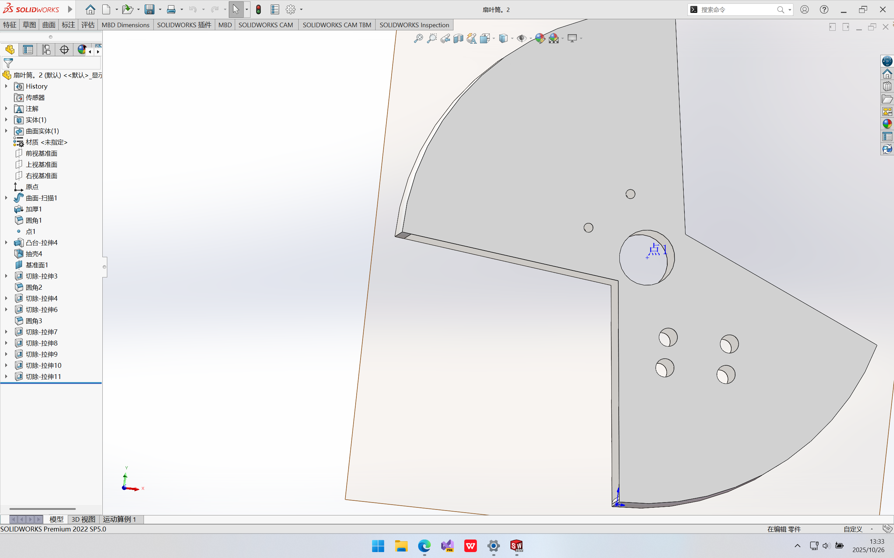
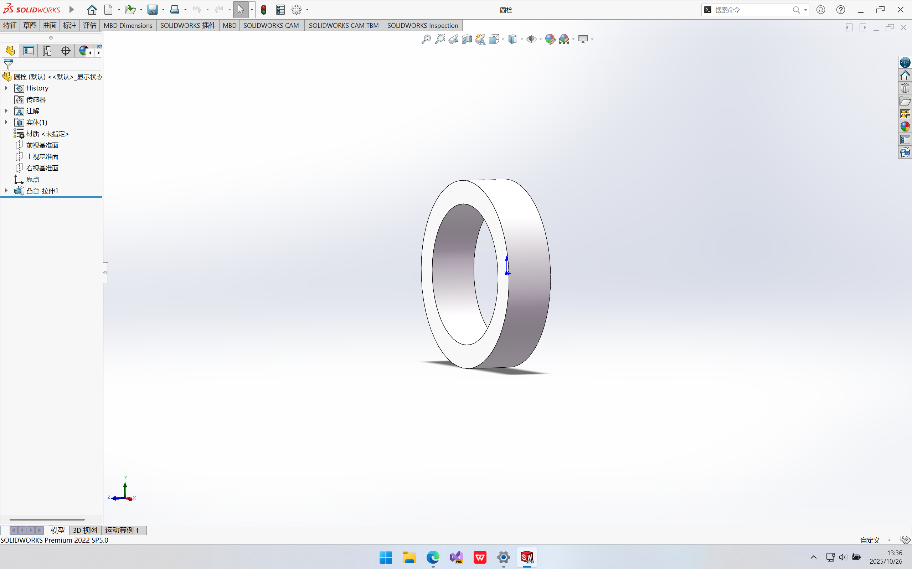
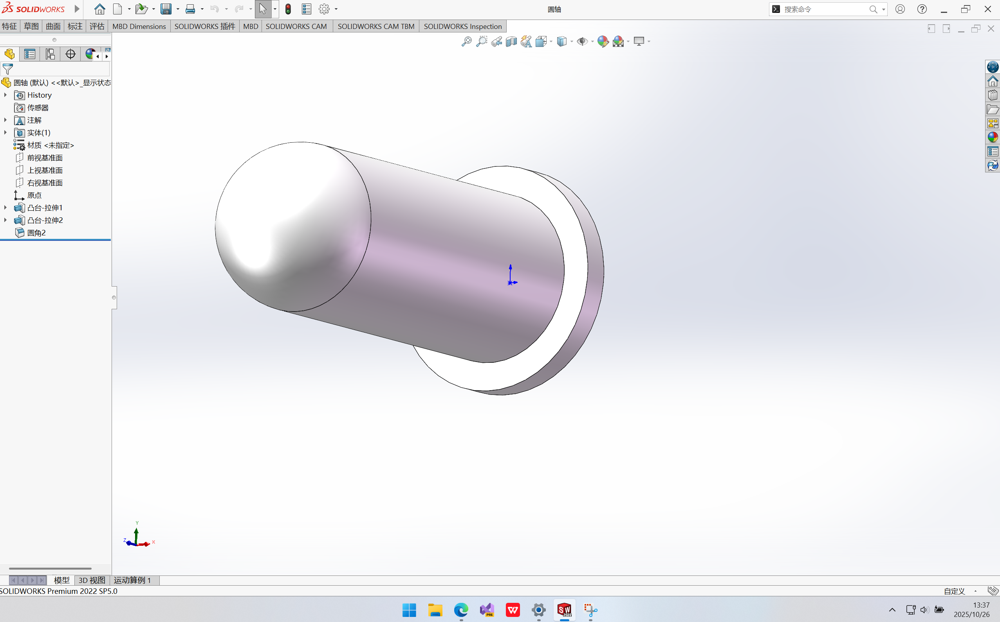
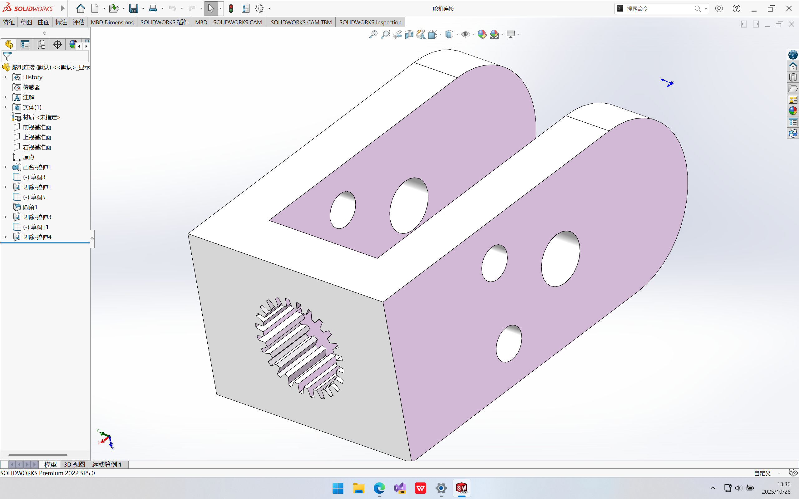
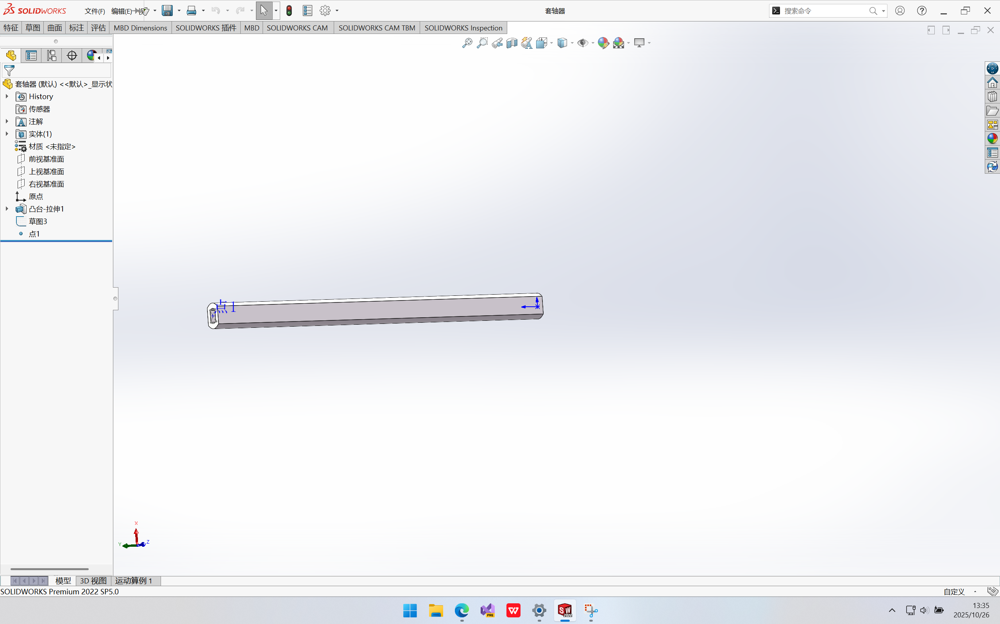
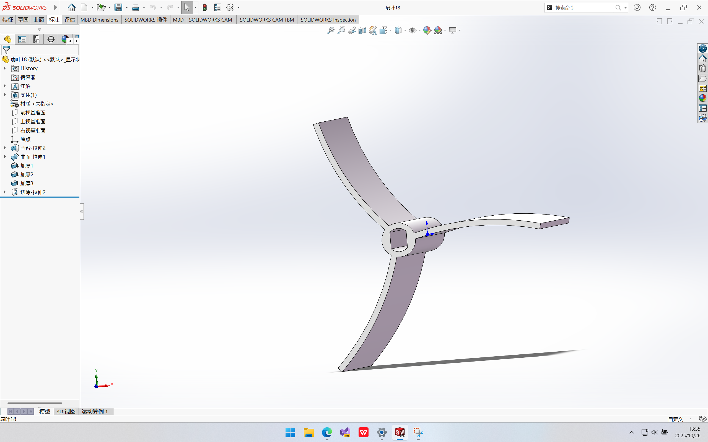

# 弹丸收集小车机械设计文档
## 一、收集装置设计与优化
### 功能描述

收集装置是弹丸收集小车的核心执行部件，负责在比赛过程中快速、高效地将场地内的弹丸收集并输送至车载存储斗。本装置需适应比赛场地内弹丸的物理特性（直径、重量等），同时满足赛事对机器人高度（收起状态）和长度的严格限制，确保在变形展开后具备足够的收集范围，收起后符合场地通行要求。

### 开发历程
#### 1. 方案调研与技术选型

项目初期，团队通过B站、技术论坛等渠道调研了现有弹丸收集方案，发现多数成熟设计针对乒乓球（轻质、大直径）采用**刷子式收集结构**：利用旋转刷子将球扫入通道，再通过传送带输送至存储装置。但本次比赛使用的弹丸重量更大、直径更小（为Φ17mm硬质塑料球），刷子方案存在以下缺陷：
- 弹丸易从刷子间隙漏出，收集效率低；
- 刷子对小重量弹丸的摩擦力不足，难以驱动弹丸进入输送通道；
- 刷子磨损快，长期使用稳定性差。

经过对比分析，团队决定采用**扇叶式收集结构**替代刷子方案，核心优势如下：
| 方案        | 收集效率 | 适配小直径弹丸 | 稳定性 | 能耗 |
|-------------|----------|----------------|--------|------|
| 刷子式      | 较低     | 差（易漏球）   | 差（易磨损） | 中   |
| 扇叶式      | 较高     | 好（离心力聚集）| 好（刚性结构） | 低   |

扇叶式结构通过高速旋转的扇叶产生离心力，将弹丸聚集至中心入口，配合倾斜挡板导入车载存储斗，更适合小直径、较高重量弹丸的收集。该结构核心组成部件如下：
- 外筒：
- 螺帽：
- 螺钉：

#### 2. 难点与解决方案：高度限制下的变形设计
赛事规则明确要求机器人在未启动时（初始状态）长度不超过27cm，而扇叶式收集装置若固定安装，长度会超出限制。为此，团队设计了**可变形抬升机构**，解决思路如下：

在变形机构方案构思阶段，团队曾考虑采用纯物理触发式变形（如急停后利用惯性使收集装置下摆展开），该方案无需额外动力元件，可简化结构并降低能耗。但经多轮论证后发现其存在不可忽视的缺陷：
- **可靠性不足**：依赖物理触发依赖运动惯性，受场地平整度、急停速度等因素影响显著，在比赛复杂工况下可能出现展开角度不足或卡滞；
- **结构强度风险**：急停瞬间的冲击力易导致收集装置与车身连接部位产生较大应力，长期使用易导致连接件疲劳断裂，而强化结构又会增加整体重量，影响小车机动性；
- **收起状态稳定性差**：纯物理结构缺乏可靠的锁止机制，容易违反初始尺寸限制。

基于上述问题，团队最终放弃纯物理方案，转而采用主动驱动的连杆机构：
- **机械结构**：采用连杆机构连接收集装置与车身，通过舵机驱动连杆旋转，实现收集装置的"收起-放下"动作（初始状态收起至车身上部，比赛开始后完全展开）；
- **限位设计**：在连杆旋转轨迹末端设置机械限位块，确保展开后收集装置与地面保持5mm间隙（避免摩擦阻力），收起后整体长度控制在26cm（留1cm冗余）；
- **动力选型**：对比舵机，最终选择扭矩13kg·cm的MG995舵机。

实现变形功能的核心部件：抬升装置：

#### 3. 扇叶角度优化与版本迭代
扇叶结构的设计直接影响收集效率，团队通过三次原型迭代完成优化： 
- **第一代原型**：因尺寸计算失误导致套轴器长度不足，直接判定不合格。套轴器结构：
- **第二代原型**：修正尺寸误差后采用直扇叶设计，虽满足尺寸要求，但存在两个问题：① 弹丸与扇叶接触时易发生刚性碰撞，导致弹丸弹跳逃逸；② 直扇叶产生的径向离心力不均匀，弹丸聚集效率低（每秒仅收集3-4颗）；
- **第三代原型**：采用**15°圆心角的弧形扇叶**，解决了第二代的缺陷：
  - 15°弧度设计使扇叶与弹丸接触时形成"缓冲曲面"，弹丸接触扇叶后沿弧面滑动而非弹跳，减少逃逸率；
  - 弧形结构旋转时产生的离心力方向沿弧面切线逐渐变化，可将弹丸平稳导向中心入口，配合扇叶旋转速度，形成持续的"汇聚流场"，收集效率提升；
  - 15°角度兼顾了扇叶强度与气流扰动：角度过小时（<10°）扇叶推球力度不足，角度过大时（>20°）旋转产生的气流会将边缘弹丸吹离，15°为查询后的最优值。

优化后的扇叶结构：

#### 4. 创新点
- **扇叶弧度仿生设计**：参考自然界流线型结构，15°弧形扇叶在旋转时形成低压区，辅助吸附弹丸向中心移动，相比直扇叶提升边缘弹丸捕获率；

## 二、存储装置设计与优化
### 功能描述

存储装置是弹丸收集流程的终端承载部件，核心功能是与收集装置高效衔接，实现弹丸的稳定接收、存储，同时需适配收集装置的“收起-展开”变形动作，避免结构干涉，且在小车运动（转弯、颠簸、碰撞）过程中无弹丸掉落，整体尺寸需符合赛事初始状态长度≤27cm的限制，为收集装置预留足够收起空间。

### 开发历程
#### 1. 初始方案设计与核心缺陷

项目初期，由于缺乏适配小直径弹丸（Φ17mm）与可变形收集装置的现成方案，团队首先参考常规容器结构，设计了**四面封闭平底盒体方案**：盒体采用全封闭结构（仅顶部预留与斜坡连接的开口），底部为水平平面，通过独立的倾斜斜坡连接收集装置出口与存储盒入口，实现弹丸输送。但该方案经初步装配与测试后，暴露出三大关键问题：
- **连接结构复杂且脆弱**：收集装置、斜坡、存储盒需通过螺丝、卡扣等多重结构拼接固定，形成三段式输送路径。小车运动中的颠簸或碰撞易导致拼接处松动，甚至出现斜坡脱落、盒体移位，直接中断弹丸输送；且多次拆卸维护后，连接部位磨损加剧，可靠性进一步下降。
- **空间适配冲突严重**：因收集装置初始状态需收起至车身上部，封闭盒体的顶部与后侧空间被完全占用，导致收集装置收起时与盒体侧壁、顶部发生硬性干涉。若为避让收集装置额外预留空间，会使小车整体长度超出27cm的赛事限制，不符合参赛要求。

#### 2. 优化方案设计与技术细节
针对初始方案的缺陷，团队围绕“简化结构、适配空间、防掉球”三大目标，重新设计存储装置，核心优化点如下：
- **底部20°倾斜设计**：放弃水平底部，将存储装置底部设计为20°固定倾斜角。该角度通过重力模拟测试确定：既能利用重力驱动弹丸自动向存储装置内部滑动，避免在入口处堆积；又能确保小车在正常运动（包括转弯、爬5°以内斜坡）时，弹丸不会因倾斜角度过大而自行滑出，平衡了输送效率与存储稳定性。
- **前侧开放式结构**：取消前侧封闭壁，使存储装置前侧直接与收集装置出口对接，将原有的“收集装置-斜坡-存储盒”三段式结构简化为“收集装置-存储装置”两段式结构。不仅减少了连接部件，降低了松动风险；还为收集装置收起时预留了充足的前侧空间，彻底解决了结构干涉问题，使小车初始状态长度控制在26cm（预留1cm冗余）。
- **鱼骨式固定防掉球结构**：在存储装置左右侧壁内侧，设计并安装**不可活动的斜向挡板**（即“鱼骨结构”），挡板与侧壁呈60°固定夹角，且相邻挡板间距小于弹丸直径（Φ17mm）。该设计参考单向阀门的逆止原理：
  - 弹丸从收集装置进入存储装置时，会沿挡板的倾斜面顺畅滑入内部，60°夹角的导向性可避免弹丸撞击侧壁后反弹；
  - 当小车运动颠簸或受到碰撞，已进入的弹丸有向外滑动趋势时，固定挡板会形成物理阻挡，阻止弹丸从开放式前侧脱出；
  - 相比可活动式挡板（曾考虑过的方案），固定结构无需依赖弹丸冲击力驱动，可避免因弹丸重量轻（Φ17mm硬质塑料球）导致的挡板无法推开、入口堵塞问题，同时减少活动部件的磨损与维护成本。

## 三、动力装置设计与优化
### 功能描述

动力装置作为小车运动的核心驱动部件，需为小车提供稳定的前进、后退、转向及原地旋转动力，同时适配小车整体重量（含弹丸存储后的满载重量）与比赛场地环境，确保在复杂工况下（如场地摩擦变化、弹丸重心偏移）仍具备良好的操控性，满足快速移动与精准定位的需求。本装置采用四个麦克纳姆轮作为执行元件，核心设计重点在于轮组安装方式的优化，以平衡动力输出与操控灵活性。

### 开发历程
#### 2. 安装方式选择：“一侧相同”的优势分析
- **操控逻辑更直观，降低控制难度**：“一侧相同”的安装方式与常规四轮小车的操控逻辑更接近——左侧轮组正向旋转、右侧轮组反向旋转时，小车可直接实现原地左转；两侧轮组同向同速旋转时，小车沿直线前进/后退。这种逻辑无需额外复杂的差速算法校准，可减少STM32控制程序的编写难度，降低因算法失误导致的运动偏差（如“对角相同”安装需精确控制四个轮子的转速差，否则易出现“偏移转向”问题）。
- **适配小车重心分布，提升运动稳定性**：小车存储装置位于车身中后部，弹丸存储后重心会向后偏移。若采用“对角相同”安装，对角线轮组受力不均时易出现单侧打滑（如后对角线轮组负载过大，前对角线轮组抓地力不足）；而“一侧相同”安装可使同一侧轮组均匀分担负载，左侧轮组与右侧轮组分别对应车身左半部分与右半部分的重量，即使重心偏移，两侧轮组仍能保持稳定的抓地力，减少打滑概率
- **维修维护更便捷，降低故障风险**：“一侧相同”安装时，同一侧轮组的电机接线、传动结构可采用对称设计，如左侧两个轮子的电机控制线可共用同一组接口，右侧同理。这种结构简化了布线，且当某一侧轮组出现故障（如电机卡顿、轮子松动）时，可直接对单侧进行拆卸维修，无需调整对角轮组的位置；而“对角相同”安装的轮组布线交叉，维修时需同步检查对角线轮组，操作繁琐且易破坏其他部件的安装精度。
- **适应比赛场地特性，减少运动阻力**：比赛场地地面为光滑硬质塑料材质，“对角相同”安装的轮组在原地旋转时，对角线轮组的辊子与地面接触方向相反，易产生相互抵消的摩擦力，导致旋转阻力增大、能耗升高；“一侧相同”安装时，左右侧轮组的辊子接触地面方向一致，旋转时摩擦力方向统一，原地旋转所需扭矩较“对角相同”降低，不仅减少电机负载，还能提升旋转速度。
